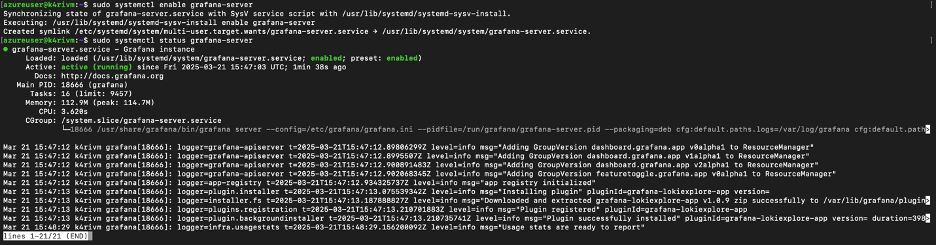
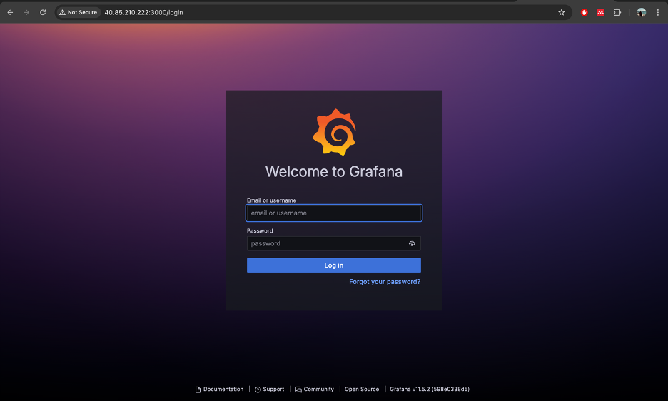
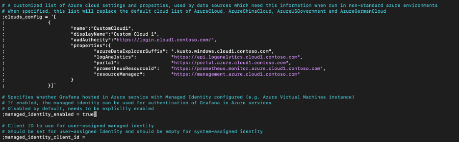
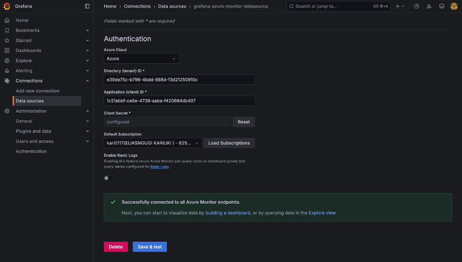
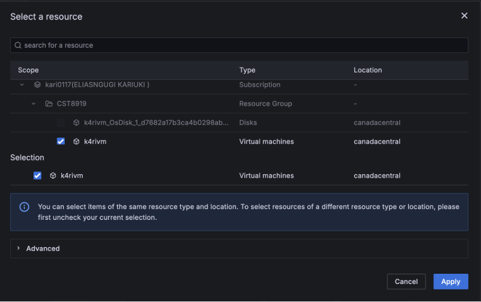
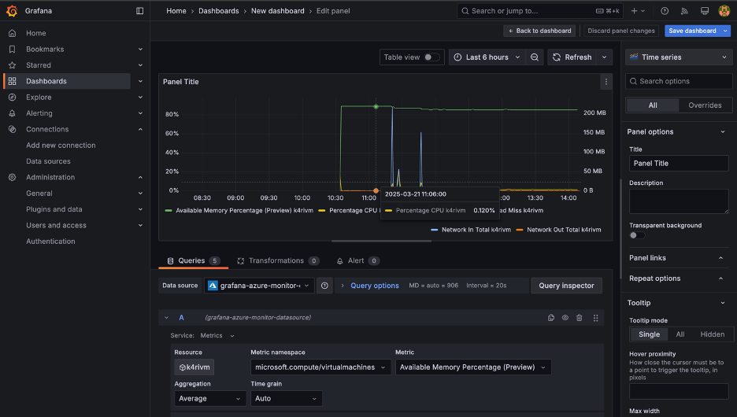

# Grafana_Intro

## Proof of Concept
The following lab is an overview showing how to connect grafana to azure monitor and display metrics using an intuitive dashboard

### Grafana Status

Checking if Grafana works

### Grafana Login

Logging into Grafana – accessed the Grafana GUI using port 3000

### Connecting Grafana to Azure Monitor

Enabling authentication for Grafana data sources

### Connecting to Azure monitor

Made a connection to Azure monitor by creating a service principal in Azure and adding the role

### Computing metrics

1. Selecting the vm

2. ### Dashboard

Selected different metrics to monitor on the vm to output the following real time dashboard

### Issues encountered

The main issue encountered was connecting Grafana to Azure monitor which had no option for Azure Managed Identity. The solution was to use a different method of connection through Azure active directory by creating a service principal